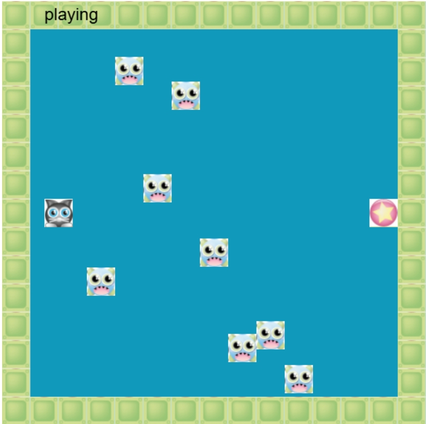
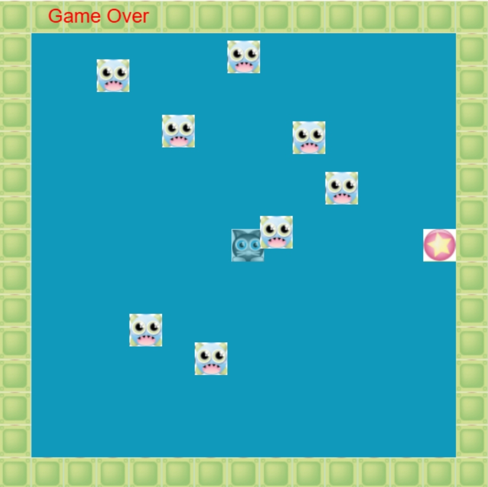

## 探险者小游戏--explorer game

### 游戏开发说明

- 使用插件 pixi.4.5.5 开发

### 游戏玩法说明

- 玩家控制探险者在地图上移动，寻找宝藏
- 玩家可以使用键盘方向键控制探险者的移动
- 探险者移动过程中不能触碰拦截者，否则游戏结束
- 玩家躲过拦截者后触碰到宝物，游戏胜利

### 游戏截图

### 项目启动说明

- 下载游戏源码
- npm install 安装依赖
- npm run dev 启动项目
- 或者 npm run build 打包项目，在打包文件夹 dist 下使用 anywhere 或者 http-server 插件启动项目

### 后续准备添加的功能

- 增加关卡
- 增加难度级别
